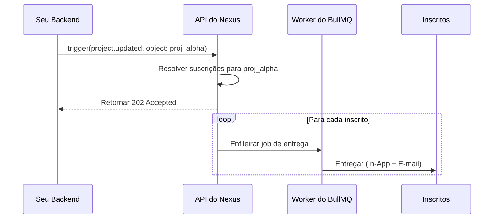

# Notificações de Envio em Leque de Objetos

Este guia descreve o fluxo completo de **Objetos e Suscrições**: registrar uma entidade, inscrever usuários nela e disparar notificações em leque (fan-out) para todos os observadores com uma única chamada de disparo.

---

## O Problema que Isso Resolve

Sem os objetos, seu backend precisa:

1. Consultar uma tabela de `watchers` (observadores) para obter a lista de inscritos.
2. Fazer um loop e disparar o workflow para cada usuário individualmente.

Com os Objetos, o Nexus gerencia a lista de observadores para você. Você faz o disparo apenas uma vez informando a referência do objeto, e o Nexus resolve + entrega as mensagens para todos os inscritos automaticamente.

---

## Cenário

Sua aplicação possui projetos. Quando o marco (milestone) de um projeto é concluído, todos os membros da equipe que o estão acompanhando devem ser notificados instantaneamente — sem que seu backend precise consultar a tabela de observadores.

---

## Passo 1 — Registrar o Objeto

Quando um novo projeto é criado em sua aplicação, realize o upsert dele no Nexus:

```ts
import { NexusClient } from '@nexus-signal/node';

const nexus = new NexusClient({ secretKey: process.env.NEXUS_SECRET_KEY });

await nexus.objects.set({
  collection: 'projects',
  externalId: 'proj_alpha',
  name: 'Project Alpha',
  properties: {
    status: 'active',
    repo: 'acme/alpha',
    priority: 'high',
  },
});
```

- `collection`: Alfanumérico em letras minúsculas com hífen/sublinhado (por exemplo, `projects`, `issues`, `orders`). Isso fará parte do caminho da API.
- `externalId`: O ID interno da entidade em sua aplicação (máx. 128 caracteres).
- `properties`: Qualquer metadados personalizados em formato de chave-valor — acessíveis nos modelos como `{{ object.properties.key }}`.

---

## Passo 2 — Inscrever Usuários

Quando um usuário clica em **Acompanhar (Watch)** em sua interface:

```ts
await nexus.objects.addSubscriptions('projects', 'proj_alpha', {
  recipients: [user.externalId],
  properties: { role: 'watcher' }, // metadados opcionais por assinatura
});
```

- `recipients`: Array contendo strings de `externalId` dos inscritos. Os inscritos já devem existir no ambiente.
- `properties`: Metadados de chave-valor opcionais salvos na assinatura (por exemplo, `role`, `notificationLevel`).

Quando um usuário clica em **Deixar de Acompanhar (Unwatch)**:

```ts
await nexus.objects.removeSubscriptions('projects', 'proj_alpha', [user.externalId]);
```

---

## Passo 3 — Criar o Workflow

No painel de controle, crie um workflow chamado `project.updated` com os nós de canal **In-App** e **Email**.

Use as variáveis de contexto do objeto nos modelos:

**Modelo In-App:**

```json
{
  "title": "{{ object.name }} was updated",
  "body": "Status changed to {{ object.properties.status }}",
  "redirect": "/projects/{{ object.externalId }}"
}
```

**Modelo de E-mail (HTML):**

```html
<h2>Update: {{ object.name }}</h2>
<p>The project status is now <strong>{{ object.properties.status }}</strong>.</p>
<p>Milestone reached: {{ data.milestone }}</p>
```

Variáveis de contexto de objeto disponíveis:

- `{{ object.name }}` — o nome de exibição do objeto
- `{{ object.externalId }}` — o ID externo do objeto
- `{{ object.collection }}` — o nome da coleção
- `{{ object.properties.key }}` — qualquer propriedade personalizada

---

## Passo 4 — Disparar com o Objeto como Destinatário

Quando o marco do projeto for concluído, dispare o trigger utilizando a referência do objeto em vez de passar uma lista de inscritos:

```ts
await nexus.workflows.trigger({
  workflowName: 'project.updated',
  recipients: [{ collection: 'projects', id: 'proj_alpha' }],
  data: {
    changeType: 'milestone_completed',
    milestone: 'v1.0 Launch',
  },
});
```

O Nexus resolverá todos os inscritos ativos que estão acompanhando `projects/proj_alpha` e criará jobs de entrega individuais para cada um deles.



---

## Passo 5 — Verificar a Entrega

No painel de controle, abra os **Audit Logs**. Cada observador recebe uma linha de log separada exibindo seu status de entrega individual e o conteúdo do canal.

---

## Dicas

- **Inscrição em lote na importação**: Use o método `addSubscriptions` com um array de até 100 destinatários de uma só vez ao migrar dados existentes.
- **Propriedades do objeto controlam condições de etapas**: Use `{{ object.properties.priority }}` em [condições de etapas](/docs/platform/features/step-conditions) para enviar e-mails apenas para objetos de alta prioridade.
- **Combine com tópicos**: Adicione o workflow a um [tópico](/docs/platform/features/topics) para que os usuários possam desativar as notificações de projetos nas configurações de preferências.
- **Limpeza na exclusão**: Chame `nexus.objects.delete('projects', 'proj_alpha')` quando o projeto for excluído para remover todas as assinaturas associadas de forma automática.

---

## Limites

| Limite                                          | Valor  |
| :---------------------------------------------- | :----- |
| Máximo de objetos por ambiente                  | 5.000  |
| Máximo de observadores por objeto               | 10.000 |
| Tamanho máximo do lote de adição/remoção        | 100    |
| Máximo de chaves de propriedades personalizadas | 50     |

---

## Relacionado

- [Visão geral do recurso de Objetos e Suscrições](/docs/platform/features/objects-subscriptions)
- [Referência da API de Objetos](/docs/api/objects)
- [Condições de etapa](/docs/platform/features/step-conditions) — ramificação baseada em propriedades
