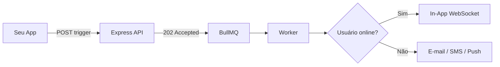

# Plataforma Nexus Signal

**Nexus Signal** é uma infraestrutura de notificação focada no desenvolvedor. Uma única API e um canvas de fluxo de trabalho visual direcionam mensagens através de **10 canais** enquanto você mantém **suas próprias chaves de provedor** — sem acréscimo de custo por mensagem, sem aprisionamento tecnológico.

Aqui você encontra tudo o que precisa para operar o Nexus como seu painel de controle de notificações — desde o seu primeiro fluxo de trabalho até a produção.

<Cards>
  <Card title="Início Rápido" href="/docs/platform/getting-started/quickstart" description="Envie sua primeira notificação em menos de 5 minutos." />
  <Card title="Primeiros Passos" href="/docs/platform/getting-started" description="Espaço de trabalho, ambientes e autenticação." />
  <Card title="Conceitos" href="/docs/platform/concepts" description="Arquitetura, BYOP, fluxos de trabalho e pipeline." />
  <Card title="Recursos" href="/docs/platform/features" description="Horário inteligente, presença, IA e ferramentas de custos." />
  <Card title="Integrações" href="/docs/platform/integrations" description="SendGrid, Twilio, Slack e webhooks." />
  <Card title="Guias" href="/docs/platform/guides/first-workflow" description="Primeiro fluxo de trabalho e lista de verificação de produção." />
</Cards>

## O que torna o Nexus diferente

| Funcionalidade | Benefício |
|------------|---------|
| **Supressão por presença** | Pule envios redundantes de push/SMS quando os usuários estiverem online — menor gasto com provedores |
| **Envio inteligente com IA** | Entregue na hora de maior engajamento de cada inscrito |
| **BYOP** | Suas próprias chaves do SendGrid, Twilio e Resend — sem acréscimo de custo por mensagem |
| **Análise de custos** | Gasto detalhado por provedor, canal e fluxo de trabalho com alertas de orçamento |
| **Fluxos visuais** | Atraso, compilação (digest), controle de taxa (throttle), failover, divisão A/B, janelas de entrega |

## Dez canais, um único gatilho

E-mail · SMS · Web Push · Mobile Push · In-App · WhatsApp · Slack · Discord · Teams · Webhook

```ts
await nexus.workflows.trigger({
  workflowName: 'order.shipped',
  recipients: [{ externalId: 'user_42', email: 'alex@acme.io' }],
  data: { trackingNumber: '1Z999AA10123456784' },
});
```

Retorna **202 Accepted** imediatamente — a entrega é processada assincronamente através de Redis + BullMQ.

## Fluxo básico



## Quando ler o quê

| Você deseja… | Leia |
|--------------|------|
| Enviar a primeira notificação | [Início Rápido](/docs/platform/getting-started/quickstart) |
| Entender o pipeline assíncrono | [Pipeline de entrega](/docs/platform/concepts/delivery-pipeline) |
| Reduzir gastos com provedores | [Redução de custos](/docs/platform/features/cost-reduction) |
| Melhorar taxas de abertura | [Smart send-time](/docs/platform/features/smart-send-time) |
| Entrar em produção com segurança | [Lista de verificação de produção](/docs/platform/guides/production-checklist) |

<Callout type="info">
Novo por aqui? Comece com o [Início Rápido](/docs/platform/getting-started/quickstart), depois leia sobre a [Arquitetura](/docs/platform/concepts/architecture).
</Callout>

## Stack

Node.js · PostgreSQL · Redis · React — API de ingestão com tempo inferior a 10ms, pipeline de entrega observável.
