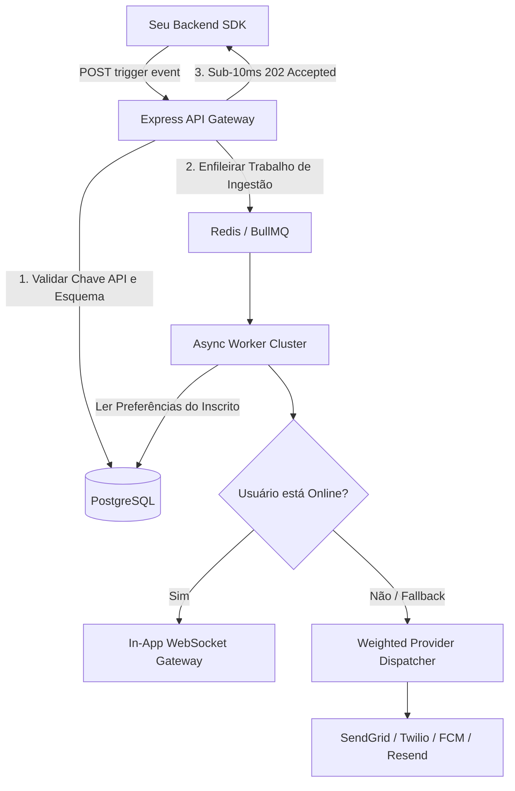

# Plataforma Nexus Signal

**Nexus Signal** é uma infraestrutura de notificação focada no desenvolvedor. Uma única API e um canvas de fluxo de trabalho visual direcionam mensagens através de **10 canais** enquanto você mantém **suas próprias chaves de provedor** — evitando taxas adicionais por mensagem e aprisionamento tecnológico (vendor lock-in).

Pense no Nexus como o seu painel de controle centralizado de notificações, orquestrando a entrega desde os eventos de disparo (trigger) iniciais até os callbacks de produção.

<Cards>
  <Card
    title="Início Rápido"
    href="/docs/platform/getting-started/quickstart"
    description="Envie sua primeira notificação em menos de 5 minutos."
  />
  <Card
    title="Primeiros Passos"
    href="/docs/platform/getting-started"
    description="Espaço de trabalho, ambientes e autenticação."
  />
  <Card
    title="Conceitos"
    href="/docs/platform/concepts"
    description="Arquitetura, BYOP, fluxos de trabalho e pipeline."
  />
  <Card
    title="Recursos"
    href="/docs/platform/features"
    description="Objetos, broadcasts, nodos de IA, guias e muito mais."
  />
  <Card
    title="Integrações"
    href="/docs/platform/integrations"
    description="SendGrid, Twilio, Slack, webhooks."
  />
  <Card
    title="Guias"
    href="/docs/platform/guides"
    description="Workflows, fan-out, broadcasts, multi-tenant."
  />
</Cards>

## Diferenças Principais

| Capacidade                     | Benefício para o Desenvolvedor e para o Negócio                                                                                                                                     |
| :----------------------------- | :---------------------------------------------------------------------------------------------------------------------------------------------------------------------------------- |
| **Supressão por Presença**     | Pula notificações push/SMS redundantes se o usuário tiver uma sessão WebSocket ativa no aplicativo — reduzindo significativamente os gastos com operadoras.                         |
| **Smart Send-Time com IA**     | Analisa automaticamente a atividade do usuário para entregar resumos de notificações ou mensagens durante sua hora de maior engajamento.                                            |
| **Arquitetura BYOP**           | Conecta as credenciais do SendGrid, Twilio, Resend e SNS diretamente. Você paga as operadoras pelo custo real de consumo com controle absoluto.                                     |
| **Análise de Custos**          | Rastreamento detalhado de gastos por provedor, canal e workflow individual com alertas automáticos de limite de orçamento.                                                          |
| **Fluxos de Trabalho Visuais** | Componha árvores de etapas com atrasos, compilação (digest), controle de taxa (throttle), divisão de teste A/B, filtros condicionais, nodos HTTP Fetch e geradores de conteúdo LLM. |
| **Object Fan-out**             | Notifique todos os inscritos de um projeto, documento, equipe ou issue com um único payload de gatilho, sem a necessidade de consultas manuais ao banco de dados.                   |
| **Multi-Tenancy B2B**          | White-label para layouts de e-mail, branding in-app e preferências de entrega por organização de cliente (tenant).                                                                  |
| **Ferramentas de CLI e MCP**   | Gerencie workflows como código sob controle de versão e integre com assistentes de codificação de IA (como Cursor, Claude Code) por meio de um servidor MCP.                        |

---

## Dez Canais, uma Única API de Gatilho

Em vez de gerenciar integrações personalizadas para E-mail, SMS, Web Push, Mobile Push, In-App (sino in-app), WhatsApp, Slack, Discord, Microsoft Teams e Webhooks individualmente, você emite um único evento para o Nexus:

```ts
import { NexusClient } from '@nexus-signal/node';

const nexus = new NexusClient({ secretKey: process.env.NEXUS_SECRET_KEY! });

await nexus.workflows.trigger({
  workflowName: 'order.shipped',
  recipients: [{ externalId: 'user_42', email: 'alex@acme.io' }],
  tenant: 'tenant_acme_corp', // Limita o estilo e as preferências a este tenant de cliente
  data: {
    customerName: 'Alex',
    orderId: 'ord_990142',
    trackingNumber: '1Z999AA10123456784',
  },
});
```

El endpoint de trigger devuelve un payload **HTTP 202 Accepted** en menos de 10ms. A plataforma enfileira o evento em uma fila resiliente apoiada por Redis, onde os workers processam as regras das suas etapas, compilam modelos localizados e direcionam as mensagens para as suas operadoras.

---

## Fluxo de Execução de Alto Nível


```mermaid
flowchart TD
    App[Seu Backend SDK] -->|POST trigger event| API[Express API Gateway]
    API -->|1. Validar Chave API e Esquema| DB[(PostgreSQL)]
    API -->|2. Enfileirar Trabalho de Ingestão| Q[Redis / BullMQ]
    API -->|3. Sub-10ms 202 Accepted| App
    Q --> Worker[Async Worker Cluster]
    Worker -->|Ler Preferências do Inscrito| DB
    Worker --> Presence{Usuário está Online?}
    Presence -->|Sim| InApp[In-App WebSocket Gateway]
    Presence -->|Não / Fallback| Carriers[Weighted Provider Dispatcher]
    Carriers --> CarrierAPIs[SendGrid / Twilio / FCM / Resend]
```

---

## Guia de Navegação de Documentos

| Você quer...                                               | Página Recomendada                                                                  |
| :--------------------------------------------------------- | :---------------------------------------------------------------------------------- |
| Integrar seu primeiro workflow                             | [Início Rápido](/docs/platform/getting-started/quickstart)                          |
| Proteger sua conexão de webhook ou WebSocket               | [Autenticação e Assinaturas HMAC](/docs/platform/getting-started/authentication)    |
| Entender a fila de retransmissão e o pipeline de execução  | [Conceitos do Pipeline de Entrega](/docs/platform/concepts/delivery-pipeline)       |
| Transmitir anúncios para um subconjunto de usuários        | [Guia do Recurso de Broadcasts](/docs/platform/features/broadcasts)                 |
| Configurar marca personalizada com white-label por cliente | [Passo a Passo de Multi-Tenancy B2B](/docs/platform/guides/b2b-multi-tenant)        |
| Monitorar margens de provedores e métricas de canal        | [Estratégias de Redução de Custos](/docs/platform/features/cost-reduction)          |
| Implantar alterações com segurança através de ambientes    | [Ambientes e Escopos de Chaves de API](/docs/platform/getting-started/environments) |

<Callout type="info">
  Você está integrando pela primeira vez? Comece com o [Início
  Rápido](/docs/platform/getting-started/quickstart) para enviar seu primeiro evento, depois leia o
  [Guia de Arquitetura](/docs/platform/concepts/architecture) para configurar seu servidor de
  desenvolvimento.
</Callout>

## Stack Tecnológica

O host do Nexus Signal é construído usando componentes web padrão de alto desempenho:

- **API Gateway**: Node.js & Express
- **Bancos de Dados**: PostgreSQL (via Prisma ORM) & Redis (caching e pub/sub)
- **Gerenciador de Filas**: BullMQ (enrutamento de contrapressão, tentativas atrasadas)
- **Tempo Real**: Socket.IO (mecanismo de conexão WebSocket para sinos in-app)
- **Componentes de UI**: React & Tailwind CSS
