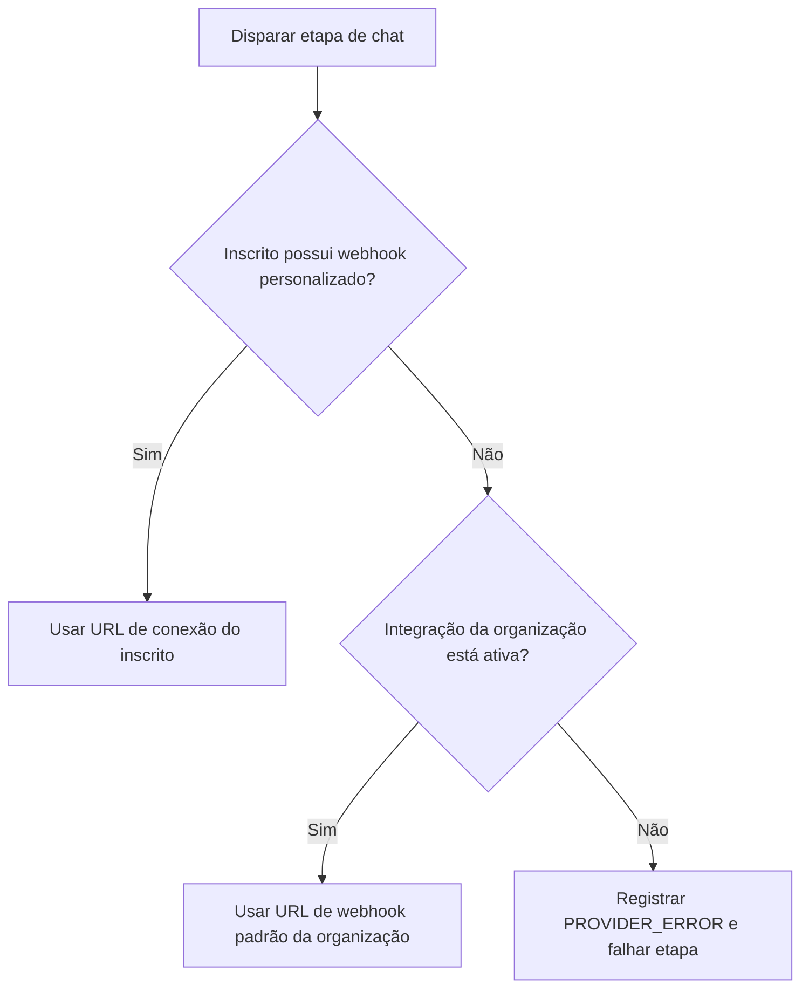

# Canais de Mensagens

O Nexus inclui nós de canais nativos para **Slack**, **Discord** e **Microsoft Teams**. Você pode configurar canais em nível de organização (por exemplo, enviar alertas do sistema para o Slack da sua própria empresa) ou rotear notificações para webhooks de canais exclusivos e específicos de cada inscrito.

---

## Hierarquia de Credenciais de Webhook

Ao despachar notificações de chat, o Nexus determina qual URL de webhook usar nesta ordem de prioridade:

1. **Webhook do Inscrito**: Verifica o perfil do inscrito para conexões personalizadas (por exemplo, `slackWebhookUrl` em `channelConnections` do inscrito).
2. **Webhook da Organização**: Faz fallback para as credenciais padrão salvas nas configurações de integração do respectivo provedor no ambiente.



---

## Roteamento de Webhook por Inscrito

Para rotear notificações para canais específicos de inscritos (por exemplo, canais de DMs pessoais do Slack ou canais de workspaces de equipes), passe as URLs de webhooks exclusivas na requisição de disparo:

```ts
await nexus.workflows.trigger({
  workflowName: 'billing.invoice',
  recipients: [
    {
      externalId: 'user_42',
      slackWebhookUrl: 'https://hooks.slack.com/services/{workspace_id}/{channel_id}/{token}',
      discordWebhookUrl: 'https://discord.com/api/webhooks/{channel_id}/{token}',
      teamsWebhookUrl:
        'https://your-org.webhook.office.com/webhookb2/{guid}@{tenant_id}/IncomingWebhook/{id}/{token}',
    },
  ],
  data: { amount: 150 },
});
```

### Persistência Automática

- Quando as URLs de webhooks são passadas no payload de um disparo, o Nexus as extrai automaticamente e as grava no objeto `channelConnections` do inscrito no banco de dados.
- Disparos futuros para o mesmo inscrito reutilizarão essas URLs de conexão armazenadas em cache — você só precisa passá-las uma única vez (geralmente quando o usuário vincula sua ferramenta de chat na interface de configurações da sua aplicação).

---

## Formatos de Payload Esperados

O Nexus adapta automaticamente o conteúdo em texto de seus modelos para corresponder às especificações de layout de cada plataforma de chat:

| Canal               | Chave      | Formato | Comportamento do adaptador                                                                |
| :------------------ | :--------- | :------ | :---------------------------------------------------------------------------------------- |
| **Slack**           | `slack`    | JSON    | Despacha o payload como `{ "text": "..." }`. Suporta o markdown padrão do Slack (mrkdwn). |
| **Discord**         | `discord`  | JSON    | Despacha o payload como `{ "content": "..." }`.                                           |
| **Microsoft Teams** | `ms_teams` | JSON    | Compila um bloco JSON de Adaptive Card contendo o título e o corpo da mensagem.           |

## Configuração do Workflow

1. Crie um workflow e adicione um nó de canal do **Slack**, **Discord** ou **Teams** ao canvas.
2. Nas configurações do nó, selecione a chave do provedor que será usada como fallback.
3. Salve e dispare o workflow.

## Relacionado

- [Cliente do Node SDK](/docs/sdk/backend/node) — documentação do esquema de destinatários (recipients)
- [Integrações de webhooks](/docs/platform/integrations/webhooks) — envios de payloads personalizados
- [Arquivos de tradução](/docs/platform/features/translations) — localizando textos de chat
