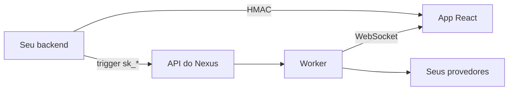

# SDKs do Nexus Signal

Pacotes oficiais para acionar fluxos de trabalho a partir do seu backend e renderizar notificações in-app no navegador.

<Cards>
  <Card title="Node.js SDK" href="/docs/sdk/node" description="Gatilhos, agendamentos, HMAC — apenas no servidor." />
  <Card title="React SDK" href="/docs/sdk/react" description="Sino, inbox, preferências — interface do navegador." />
  <Card title="Referência da API" href="/docs/api" description="Endpoints REST se você preferir HTTP bruto." />
</Cards>

## Fluxo de integração



1. O backend aciona fluxos de trabalho com a **chave secreta** (`sk_*`)
2. O backend gera o **HMAC** para o usuário logado
3. O frontend envolve a aplicação no `NexusProvider` com **chave pública + HMAC**
4. As notificações in-app são transmitidas para o `NotificationCenterBell`

## Exemplo rápido de gatilho

```ts
import { NexusClient } from '@nexus-signal/node';

const nexus = new NexusClient({
  secretKey: process.env.NEXUS_SECRET_KEY!,
  baseUrl: 'https://api.nexussignal.dev',
});

await nexus.workflows.trigger({
  workflowName: 'order.shipped',
  recipients: [{ externalId: 'user_42', email: 'alex@acme.io' }],
  data: { trackingNumber: '1Z999AA10123456784' },
});
```

## Requisitos

| SDK | Requisitos |
|-----|----------|
| Node | Node.js 18+ |
| React | React 18/19, `socket.io-client` ^4.8 |

## Instalação

<Tabs items={['npm', 'pnpm', 'yarn']}>
  <Tab value="npm">

```bash
npm install @nexus-signal/node
npm install @nexus-signal/react socket.io-client
```

  </Tab>
  <Tab value="pnpm">

```bash
pnpm add @nexus-signal/node
pnpm add @nexus-signal/react socket.io-client
```

  </Tab>
  <Tab value="yarn">

```bash
yarn add @nexus-signal/node
yarn add @nexus-signal/react socket.io-client
```

  </Tab>
</Tabs>

<Callout type="info">
Integração apenas com REST? Pule o SDK do React e use a [Referência da API](/docs/api) com seu cliente HTTP.
</Callout>

<Callout type="warn">
Nunca exponha chaves secretas `sk_*` no código do navegador. Use chaves públicas `pk_*` apenas para rotas do SDK.
</Callout>
