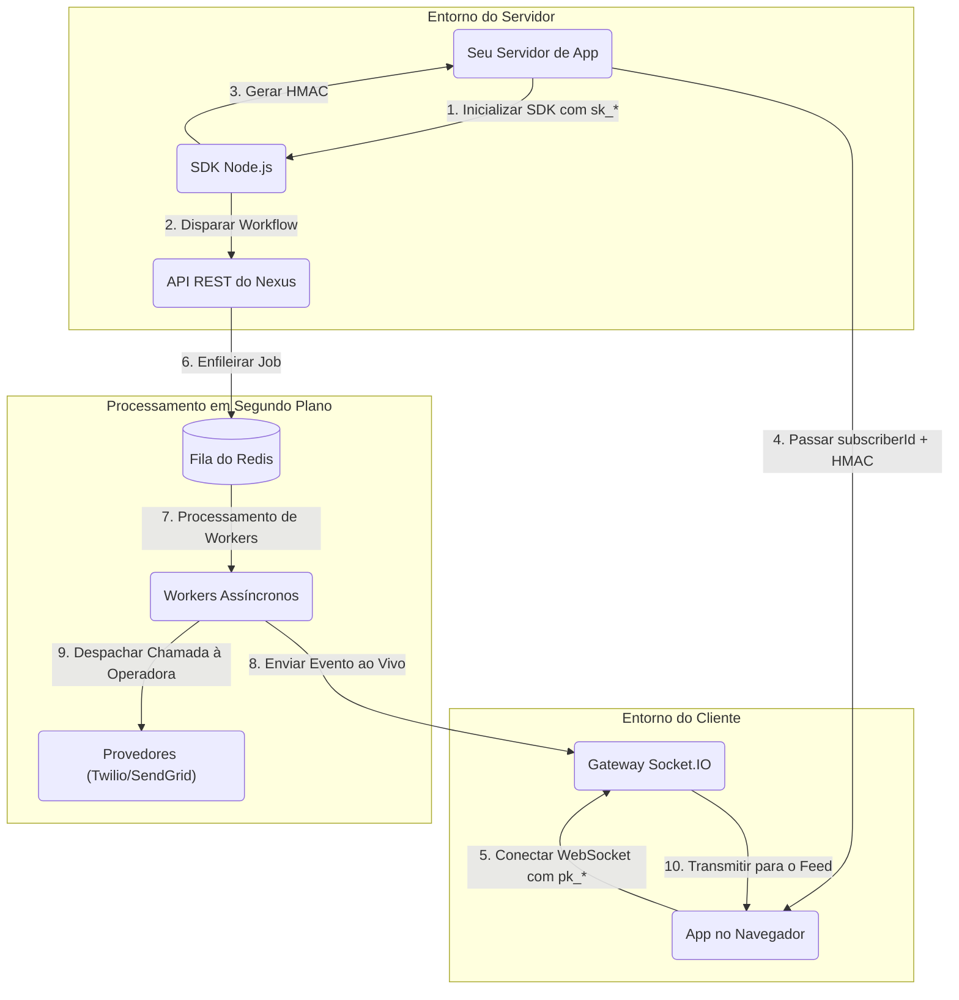

# SDKs do Nexus Signal

Bibliotecas oficiais, componentes de cliente, interfaces de linha de comando e kits de ferramentas de IA para integrar o Nexus Signal ao seu stack tecnológico.

---

## Bibliotecas de Cliente e Servidor

Acesse nossas principais bibliotecas do lado do cliente e do servidor para gerenciar gatilhos, inscritos e estados de interface:

<Cards>
  <Card
    title="Node.js SDK"
    href="/docs/sdk/backend/node"
    description="Gatilhos de workflows em backend, escopos de múltiplos inquilinos (tenants), schedules e assinaturas HMAC criptográficas."
  />
  <Card
    title="React SDK"
    href="/docs/sdk/frontend/react"
    description="Sino de notificação pronto para uso, inbox de feed completo, matriz de preferências do usuário e guias em tempo real."
  />
  <Card
    title="SDK JS Headless"
    href="/docs/sdk/frontend/js"
    description="Cliente agnóstico de framework para Vue, Svelte ou HTML5 puro sem dependências de estilos embutidos."
  />
  <Card
    title="Angular SDK"
    href="/docs/sdk/frontend/angular"
    description="Componentes independentes (standalone) e Signals nativos para centros de notificação reativos (Angular 17+)."
  />
</Cards>

---

## Ferramentas de Desenvolvimento

Gerencie estados de workflows, integrações de CI/CD e pacotes de modelos locais:

<Cards>
  <Card
    title="Workflow-as-code"
    href="/docs/sdk/workflow/workflow-as-code"
    description="Defina as etapas de notificação em TypeScript e envie-as programaticamente para o painel de controle."
  />
  <Card
    title="Nexus CLI"
    href="/docs/sdk/devtools/cli"
    description="Baixe ou envie recursos, gerencie inscritos e sincronize modelos a partir do seu terminal ou runner."
  />
  <Card
    title="Servidor MCP"
    href="/docs/sdk/devtools/mcp-server"
    description="Conecte assistentes de codificação de IA como Cursor e Claude às ferramentas do seu workspace usando linguagem natural."
  />
  <Card
    title="Referência de API"
    href="/docs/api"
    description="Endpoints diretos de API REST para integrações HTTP personalizadas em qualquer linguagem de programação."
  />
</Cards>

---

## Fluxo de Arquitetura Integrada

O diagrama a seguir rastreia os limites das transações entre os envios do lado do servidor, sockets de agentes de usuários e retransmissões de provedores externos:


```mermaid
flowchart TD
  subgraph Server Environment [Entorno do Servidor]
    App(Seu Servidor de App) -->|1. Inicializar SDK com sk_*| SDK(SDK Node.js)
    SDK -->|2. Disparar Workflow| API(API REST do Nexus)
    SDK -->|3. Gerar HMAC| App
  end

  subgraph Client Environment [Entorno do Cliente]
    App -->|4. Passar subscriberId + HMAC| FE(App no Navegador)
    FE -->|5. Conectar WebSocket com pk_*| WebHost(Gateway Socket.IO)
  end

  subgraph Background Processing [Processamento em Segundo Plano]
    API -->|6. Enfileirar Job| Q[(Fila do Redis)]
    Q -->|7. Processamento de Workers| Workers(Workers Assíncronos)
    Workers -->|8. Enviar Evento ao Vivo| WebHost
    Workers -->|9. Despachar Chamada à Operadora| Carriers("Provedores (Twilio/SendGrid)")
  end

  WebHost -->|10. Transmitir para o Feed| FE
```

---

## Matriz de Suporte de Pacotes

Certifique-se de que seus ambientes de execução atendam aos requisitos mínimos:

| Namespace do Pacote            | Ambiente de Execução | Dependências de Parceria    | Responsabilidade Principal                                                          |
| :----------------------------- | :------------------- | :-------------------------- | :---------------------------------------------------------------------------------- |
| **`@nexus-signal/node`**       | Node.js >= 18.0.0    | Nenhuma (Fetch Nativo)      | Gatilhos de backend, schedules, sincronização de objetos e de workflows.            |
| **`@nexus-signal/react`**      | React >= 18.0.0      | `socket.io-client >= 4.8.0` | Sinos pré-estilizados, feeds de página inteira, preferências.                       |
| **`@nexus-signal/js`**         | ES6 / HTML5          | `socket.io-client >= 4.8.0` | Handlers de armazenamento agnósticos de framework, emissores WebSocket.             |
| **`@nexus-signal/angular`**    | Angular >= 17.0.0    | `socket.io-client >= 4.8.0` | Signals reativos, wrappers de componentes independentes.                            |
| **`@nexus-signal/cli`**        | Node.js >= 18.0.0    | Nenhuma                     | Sincronização de esquemas locais, pipelines de promoção de CI/CD.                   |
| **`@nexus-signal/mcp-server`** | Node.js >= 18.0.0    | Nenhuma                     | Chamadas de ferramentas em linguagem natural para assistentes de codificação de IA. |

---

## Instalação Rápida

Configure as bibliotecas dependendo dos pontos de entrada em sua aplicação:

<Tabs items={['Server-side', 'React Client', 'Dev Tooling']}>
  <Tab value="Server-side">
    Para executar gatilhos e sincronizar workflows a partir das rotas do seu backend:
    ```bash
    npm install @nexus-signal/node
    ```
  </Tab>
  <Tab value="React Client">
    Para montar centros de notificação in-app e configurações de usuário dentro de uma árvore React:
    ```bash
    npm install @nexus-signal/react socket.io-client
    ```
  </Tab>
  <Tab value="Dev Tooling">
    Para acessar mecanismos de sincronização local ou iniciar uma instância do MCP:
    ```bash
    # Instalar a CLI globalmente
    npm install -g @nexus-signal/cli

    # Executar o servidor MCP imediatamente
    npx -y @nexus-signal/mcp-server@latest
    ```

  </Tab>
</Tabs>

<Callout type="warn">
  **Regra de Exposição de Chaves**: Nunca incorpore chaves secretas que começam com `sk_` em código
  do lado do cliente, Single Page Apps (SPAs) ou scripts compilados. As rotas públicas devem sempre
  utilizar chaves públicas (`pk_`) verificadas em relação a uma assinatura HMAC gerada estritamente
  no seu servidor.
</Callout>
