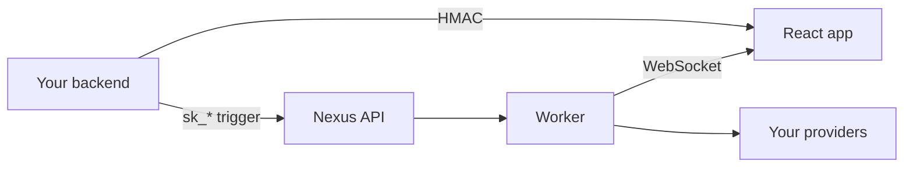

<Cards>
  <Card title="Node.js SDK" href="/docs/sdk/node" description="Triggers, schedules, HMAC — server-side only." />
  <Card title="React SDK" href="/docs/sdk/react" description="Bell, inbox, preferences — browser UI." />
</Cards>

## Integration flow



1. Backend triggers workflows with the **secret key**
2. Backend generates **HMAC** for the logged-in user
3. Frontend wraps the app in `NexusProvider` with **public key + HMAC**
4. In-app notifications stream to `NotificationCenterBell`

## Requirements

| SDK | Requires |
|-----|----------|
| Node | Node.js 18+ |
| React | React 18/19, `socket.io-client` ^4.8 |

## Install

<Tabs items={['npm', 'pnpm', 'yarn']}>
  <Tab value="npm">

```bash
npm install @nexus-signal/node
npm install @nexus-signal/react socket.io-client
```

  </Tab>
  <Tab value="pnpm">

```bash
pnpm add @nexus-signal/node
pnpm add @nexus-signal/react socket.io-client
```

  </Tab>
  <Tab value="yarn">

```bash
yarn add @nexus-signal/node
yarn add @nexus-signal/react socket.io-client
```

  </Tab>
</Tabs>

<Callout type="info">
REST-only integration? Skip the React SDK and use [API Reference](/docs/api) with your HTTP client.
</Callout>
